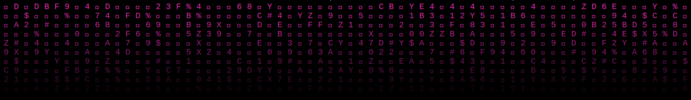

<picture>
  <source media="(prefers-color-scheme: dark)" srcset="assets/matrix-rain-dark.svg">
  <source media="(prefers-color-scheme: light)" srcset="assets/matrix-rain-light.svg">
  
</picture>

 

## 👋 About Me

Hey, I'm **Gabriel Chambers**.

💻 Computer Science Student | AI/ML Researcher | Software Engineer
🎓 B.S. Computer Science @ Alabama A&M University (Expected May 2027)
🔐 Active Secret Clearance | ☁️ AWS Certified Cloud Practitioner

I am a Computer Science student passionate about building intelligent systems through artificial intelligence, machine learning, cloud technologies, and software engineering.

 

## 💻 Technical Skills

**Languages**
 

  

**Machine Learning & AI**
 

  

**Cloud & Development**
 

  

**AI Tools**
 

 

## GitHub Stats

<picture>
  <source media="(prefers-color-scheme: dark)" srcset="https://github-readme-streak-stats.herokuapp.com/?user=Gabbycodez&hide_border=true&background=000000&stroke=FF2FC2&ring=FF2FC2&fire=FF2FC2&currStreakLabel=FF9FDC&sideNums=FF9FDC&currStreakNum=FFFFFF&sideLabels=FF9FDC&dates=FF9FDC">
  <source media="(prefers-color-scheme: light)" srcset="https://github-readme-streak-stats.herokuapp.com/?user=Gabbycodez&hide_border=true&background=FFFFFF&stroke=FF2FC2&ring=FF2FC2&fire=FF2FC2&currStreakLabel=C2008C&sideNums=333333&currStreakNum=000000&sideLabels=C2008C&dates=333333">
  
</picture>

 

## Let's Connect

<picture>
  <source media="(prefers-color-scheme: dark)" srcset="assets/matrix-rain-dark.svg">
  <source media="(prefers-color-scheme: light)" srcset="assets/matrix-rain-light.svg">
  
</picture>

